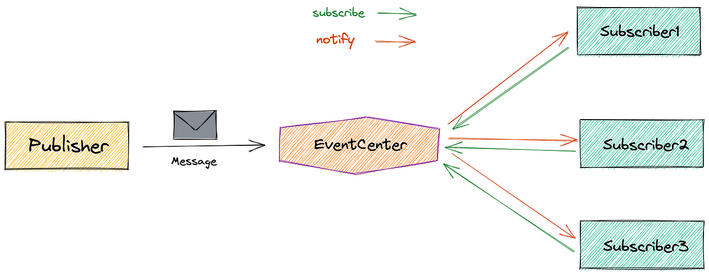

# Publisher Subscriber System
Publisher-Subscriber System in Java

# INDEX

| SR. No | Contents                                                              |
|--------|-----------------------------------------------------------------------|
| 1      | Requirement                                                           |
| 2      | Tools Used                                                            |
| 3      | What exactly is a Publisher Subscriber System? (Diagram Illustration) |
| 4      | Structure of the Code                                                 |
| 5      | The Process Description                                               |
| 6      | 7 Given API cURLs                                                     |
| 7      | <span style="color: red;"> **How to run the Project?** </span>        |
| 8      | <span style="color: red;"> **Observation and Testing** </span>        |


## Tools Used:
- Maven
- Gradle
- XChart
- JavaFX
- Spring Boot
- Java


## What exactly is a Publisher-Subscriber System?
A publisher-subscriber system is a messaging pattern where publishers send messages to a topic without knowing who subscribes to it. Subscribers express interest in specific topics and receive messages published to those topics. This decouples the sender and receiver, allowing for scalable and flexible communication. It's commonly used in event-driven architectures, messaging systems, and real-time applications.





## System Design and Code Structure

### The structure of the code according to the PA1 document can be divided into three different parts:

#### 1. ClientAPILibrary
The Client API Library has three files in total:

One that declares an interface for the publisher and its functionalities.
The client API implementation file implements that interface.
The client API controller renders that implementation into HTTPS REST APIs.
#### 2. ClientProgram
   The Client Program pulls the functions together for the publisher and the subscriber individually, verifying basic functionality:

- Registering a publisher on the server. It follows a specific format, PUB-#num. Each time the endpoint is hit, a new publisher with counter++ equals #num is created.
- Registering a topic under the publisher.
- Pushing messages to the pool of messages using the push message to pool functionality.
- Registering a subscriber on the server. It follows a specific format, SUB-#num. Each time the endpoint is hit, a new subscriber with counter++ equals #num is created.
- The subscriber can subscribe to a topic.
- A subscriber can pull messages from the pool by providing its subscriber ID and the topic it wants to pull freshly pushed messages from.
- Messages are flagged as read or unread by each subscriber, and junk messages (messages read by all subscribers) are removed from the buffer memory.
#### 3. ServerProgram
The server program maintains the anonymity of communication. It hides the details of message transportation, ensuring the client programs don’t have to handle connection establishment. The MessageBroker file initializes server-like communication to hide publishing details from subscribers and vice versa. It also maintains a buffer for different topics and handles requests from clients.

## The Process Description:
The functionality is deployed in the following order:
- registerPublisher()
- createTopic(PID, String topic)
- deleteTopic(Pid, String topic, String message)
- send(PID, String topic, String message)
- registerSubscriber()
- subscribeTopic(SID, String topic)
- List<String> pullMessages(SID, String topic)
- API Endpoints and Example Commands:
### 1. Register Publisher API
  
   ```curl --location --request POST 'http://localhost:8080/api/publisher/register'```

   This API returns a unique ID which allows the client to act as a publisher or subscriber.

### 2. Create Topic API
    curl --location 'http://localhost:8080/api/publisher/createNewTopicToPublisher' \
    --header 'Content-Type: application/json' \
    --data '{"publisherId": "PUB-1", "topic": "magazine"}'


### 3. Send Message API
   
    curl --location 'http://localhost:8080/api/publisher/sendMessageToTopic' \
    --header 'Content-Type: application/json' \
    --data '{"publisherId": "PUB-1", "topic": "magazine", "message": "Cover Page 1"}'
### 4. Register Subscriber API
    curl --location --request POST 'http://localhost:8080/api/subscriber/register'
### 5. Subscribe to Topic API
    curl --location 'http://localhost:8080/api/subscriber/subscribeToTopic' \
    --header 'Content-Type: application/json' \
    --data '{"subscriberId": "SUB-1", "topic": "magazine"}'
### 6. Pull Messages from Topic API
    curl --location 'http://localhost:8080/api/subscriber/pullMessagesFromPool?subscriberId=SUB-1&topic=magazine'
### 7. Delete Topic API
    curl --location --request DELETE 'http://localhost:8080/api/publisher/deleteTopicFromPublisher' \
    --header 'Content-Type: application/json' \
    --data '{"publisherId": "PUB-1", "topic": "magazine"}'

# How to run the Project
**To build the project using build.xml, you can simple use the following commands:**
-     ant clean
-     ant build
-     ant compile
-     ant test
-     ant clean

### Step 1:
Clone the repository using //cmd
Run the following commands to build and compile the project and start a springboot server.
-     mvn clean install
-     ./gradlew bootRun

### Step 2:
Run the SingleConnectionTests.java file to test a single connection of a publisher and a subscriber.

### Step 3:
Run the MultipleConnectionTests.java file to test multiple connections of the publisher subscriber.

### Step 4:
Run the BenchmarkTests.java file to test the benchmark throughput of each API individually. 
When you run this file, the output is saved in the form of .csvs in the root directory.

### Step 5:
Now run the Plot.java file to plot graph of the throughput testing(number of clients against the time taken in seconds), they will also get saved as a .png image in the root directory.

### Step 6:
Run the SimplePingPongTests.java to run a pin pong test between a publisher and a subscriber. 

### Step 7:
Run the PingPongThroughputTests.java file to test ping pong test between a number of publishers and subscribers.
The graph for the same shall be saved in the root directory.

#### <span style="color: red;"> **If you are not using an IDE(IntelliJ IDEA), use the below format to execute the java code.** </span>      
Firstly, navigate to the directory where your files are located 
-     javac YourFileName.java
-     java YourFileName

# Observation and Testing Results

### Benchmark testing of the APIs:


### Ping Pong Testing Plot:


